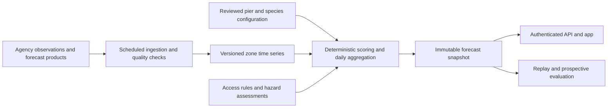

# FinFindr PierCast — Master Build Specification

> **Daily score lock and live-conditions policy — 2026-09-10:** Today's species scores, city headline, and leaderboard order are now published from one immutable full-day snapshot and remain unchanged for the Lake Michigan day. The complete evening LMHOFS issue precomputes the next snapshot; first successful commit wins, cached fallback data cannot establish a score, and publication occurs at `00:00 America/Chicago`. If the snapshot is missing, today's scores fail closed while environmental data remain available. Water forecasts continue accepting each new complete six-hour LMHOFS issue, contextual air/wind remain live, and the owner-review app silently checks conditions every 15 minutes while focused and immediately on focus. The interface labels score-lock and conditions-check state separately. The private ledger is deployed in migration `20260911021500`; `pier-cast-ingest` version 9 and `pier-cast` version 13 serve the policy. Public availability and validation gates are unchanged.

> **Full-scale seasonal recalibration — 2026-09-10:** The [v0.4 cross-port audit](PierCast_Full_Scale_Seasonal_Recalibration_v0.4.md) revisits all 20 city × species curves under a shared full-scale rubric. It applies no blanket uplift: changes are tied to mode-specific catch density, recurrence, direct pier reports, recency, and coverage limitations. Manistee steelhead is the `10.0` seasonal reference; Frankfort Chinook/steelhead and Sheboygan Chinook can also reach a final `10.0` only with nearly optimal thermal fit. Researched dead intervals now include exact `1.0` anchors. The [v0.4 replay](PierCast_Seasonal_Calibration_Replay_v0.4.md) retains strong in-sample consistency (`0.857` Spearman versus the evidence guide) with zero unsupported good-or-better Michigan monthly cells. All values remain private and provisional.

> **Evidence-foundation audit — 2026-09-10:** The historical [v0.3 all-port audit](PierCast_All_Port_Seasonal_Presence_Audit_v0.3.md) established the timing and relative ordering used by v0.4 from Michigan DNR's 1997–2022 port-specific `Pier/Dock` creel estimates, Wisconsin DNR's 2022–2024 pier tables, current stocking, and direct reports. Its numeric values are superseded by v0.4. Sparse adaptive date anchors with daily interpolation remain authoritative; weekly values are deterministic review outputs, not 52 independent configuration judgments.

> **Seasonal replay — 2026-09-10:** The current [v0.4 consistency replay](PierCast_Seasonal_Calibration_Replay_v0.4.md) evaluates 120 official Michigan port × species × month cells. Monthly seasonal ratings correlate `0.857` with the nonbinding evidence guide, every Michigan curve peaks in the evidence peak month or an adjacent month, and no configured `>= 6.0` cell lacks both long-term and modern aggregate catch support. This is retrospective in-sample evidence, not predictive validation. Sheboygan lacks comparable site-only monthly data and remains outside the quantitative replay. The [v0.3 replay](PierCast_Seasonal_Calibration_Replay_v0.3.md) remains a historical comparison only. Prospective shadow validation is still required; public ratings remain disabled.

> **Prospective shadow ledger — 2026-09-10:** The [private shadow-validation ledger](PierCast_Shadow_Validation_Ledger.md) is deployed and connected to the authenticated six-hour ingester. Each new complete model issue freezes 200 versioned forecasts: 100 active-v2 and 100 same-issue v1-comparator rows across five cities, five dates, and four core species. Outcomes are stored separately with explicit effort required for zero-catch evidence. Version 0.4 has started a separate production cohort under the [v2 prospective protocol](PierCast_Prospective_Evaluation_Protocol_v2.md); its first same-issue active/comparator pair contains 200 forecasts. The v1 protocol and v0.3 forecasts remain immutable historical evidence. Forecast collection is active, but a meaningful prospective sample remains required. Public flags and release gates remain unchanged.

> **Version 2.0 product decision — 2026-09-09:** PierCast uses city-only public profiles with a **Covers these piers** section, year-round operation, and five initial candidates: Ludington, Grand Haven, Manistee, Frankfort, and tentatively Sheboygan. The numeric product is the **FinFindr Opportunity Rating**, displayed to one decimal as **`X.X/10`**. It is not detected fish presence, a fish count, catch probability, or biological measurement.

> **Bounded-temperature v2 scoring decision — 2026-09-10:** The only numeric inputs remain a city × species **Seasonal Pier Opportunity Rating** `P_rating(c,s,t)` and water-temperature suitability `T(s,t)`. The exact formula is `score = clamp(1, 10, 1 + (P_rating - 1) × (0.30 + 0.75T))`. The seasonal curve encodes local fishery strength and fine-grained timing. Temperature retains a material penalty but cannot erase more than 70% of the seasonal opportunity above 1; only `T > 0.9333…` can exceed the seasonal rating, and perfect fit supplies at most a five-percent headroom multiplier. There is no separate permanent local baseline, annual multiplier, temperature-trend modifier, or weather modifier. Access, open water, hazards, data validity, and confidence remain separate gates/notices and never become hidden score weights. This supersedes the 2026-09-09 ceiling formula, which remains archived as the prospective shadow comparator. In product language, `T` is **nearshore thermal fit**: compatibility between modeled surface temperature and pier-reachable opportunity, not the temperature occupied by fish at depth.

> **Research status — 2026-09-10:** The upfront annual evidence inventory covers all 13 retained species and five candidate cities. A provisional [core-species seasonal calibration](PierCast_Core_Species_Seasonal_Calibration.md) supplies 20 date-level curves and 1,040 weekly review values, while the [core temperature and source calibration](PierCast_Core_Temperature_and_Source_Calibration.md) adds four shared thermal curves and five fail-closed LMHOFS source plans. Five exact, wet surface candidates are frozen in the [LMHOFS representation review](PierCast_LMHOFS_Representation_Review.md). The completed [temperature representation/calibration audit](PierCast_Temperature_Representation_and_Calibration.md) classifies all five cities as `blocked_insufficient_evidence`: Grand Haven's sparse late-summer diagnostics were encouraging through 72 hours but failed tail-error gates later; Ludington showed larger tail risk; Manistee and Frankfort lack qualified observations; Sheboygan supplied no QC-good records. The [all-five temperature pipeline](PierCast_Temperature_Pipeline_Implementation.md) now operates production-private model and strict-QC observation archives, an authenticated ingestion function, and an active six-hour schedule. Four complete model cycles (2,420 samples) and 14,036 observation records are archived; repeat ingestion, corrected validation RPC, and service-role-only access are verified. See also [Annual Species Biology and Thermal Research](PierCast_Seasonal_Temperature_Research.md), the [156-row shared month matrix](PierCast_Species_Month_Biology_Matrix.csv), [Pilot Cities Research](PierCast_Pilot_Cities_Research.md), [Environmental Data Feasibility](PierCast_Environmental_Data_Feasibility.md), and the [City Coverage and Engine Plan](PierCast_City_Coverage_and_Engine_Plan.md). Every public rating remains unapproved and disabled.

> **Owner-review implementation — 2026-09-10:** The authenticated five-date review outlook runs the provisional four-species v2 formula against one complete archived cycle for all five cities. It returns 25 city-date outlooks with duration-weighted scores, seasonal opportunity ratings, source provenance, coverage, and hourly surface-temperature points. Each authenticated ingestion run also freezes the prior ceiling formula against the identical model issue as a private comparator. The mobile owner-review screen presents the active values as disabled opportunity previews. The active private temperature candidate is v0.2: only the sub-50 °F shoulders were made less punitive; the entire v0.1 response at 50 °F and warmer is retained, and v0.1 remains available in code for comparison. Production still returns an empty public catalog and denies outlook access without a valid owner token.

> **Owner-review visual system — 2026-09-10:** PierCast opens on a discovery dashboard rather than defaulting to one city. Its daily Top 5 ranks supported cities by each city's single highest eligible species score; this is explicitly not an overall city score. The leaderboard uses an editorial hierarchy rather than five repeated rows: one large daily-winner feature, side-by-side second/third podium cards, and compact fourth/fifth finishers. The Lake Michigan intro carries date, coverage, and daily-lock status in a soft water-blue briefing card. A State → City coverage browser provides an explicit two-step report-loading action; selected shorelines and cities use pale-blue surfaces, blue outlines, and visible blue checkmarks rather than dark filled tiles. An opened report retains a distance-ordered horizontal rail of nearby supported cities. Both the discovery dashboard and every city report end with the same coverage-request workflow used by River Run, including authenticated account/view context, durable submission, and email delivery. The private PierCast report directly adopts River Run's editorial visual hierarchy: navy navigation, an arrow-only back control, ruled-paper texture, red corner marks, a large Fraunces city title, prominent target artwork, restrained mono metadata, compact hard-shadow paper cards, and consistent spacing. The hero identifies the selected day's leading species and displays its color-coded gauge. Five fixed dashboard-style day cards follow; each displays that day's highest eligible species score in the shared five-band color system. Selecting a date updates the hero and the four-species comparison, whose factors use the plain-language labels `Seasonal presence` and `Water temp suitability`. A River Run-style conditions card gives number-first water, air, and wind summaries plus one continuous horizontally scrollable hourly timeline covering the full five-date outlook. The water chart plots that complete outlook with numeric axes and shows actual temperatures at forecast start, +12 hours, and +24 hours; every delta is explicitly labeled `vs now`, while a separate hours-12–24 change explains reversals. The report ends with one concise covered-piers card and one concise rating explanation. Research status, provider provenance, grid metadata, validation ledgers, outcome-entry controls, and preview watermarks are intentionally absent from this consumer surface; owner-only access remains enforced in code. Air and wind are contextual only and never affect the PierCast score. The UI change does not alter scoring, release gates, or public availability.

**Version:** 2.0\
**Established:** 2026-09-05  
**Last audited:** 2026-09-10\
**Finalized:** 2026-09-06  
**Status:** Accepted simplified two-input specification; representation approval, outcome validation, and public release readiness remain incomplete\
**Scope:** Researched Great Lakes piers and breakwalls, with an initial limited pilot  
**Predecessor:** [PierCast_Agent_Build_Spec.md](PierCast_Agent_Build_Spec.md)

This document replaces the predecessor's implementation requirements for new PierCast work. The predecessor remains a concept record. Where they differ, follow this document. Existing River Run requirements continue to govern River Run; they do not automatically become PierCast scoring rules.

The requirements below define the product, scoring semantics, evidence standards, configuration, data processing, presentation, validation, and rollout. Numerical species preferences and pier thresholds must be researched during onboarding. An implementer must not fill those fields with remembered values or invent evidence to make a configuration pass.

**MUST** means required. **SHOULD** allows a documented implementation decision with a reason. Examples and product defaults are not biological findings. Building this specification does not itself authorize production deployment or public enablement; follow the user's actual release instructions.

### Version 2.0 scope change

Uses one city × species Seasonal Pier Opportunity Rating and water-temperature suitability as the only numeric inputs. Applies the bounded v2 temperature modifier without adding another environmental variable. Removes the redundant permanent baseline and every other live score modifier. Future dates refresh after accepted new temperature runs; today's published scores come from the immutable full-day Lake Michigan snapshot. Live environmental detail still covers the remaining local day and refreshes independently. Practical conditions remain separate. Best fishing times and fixed fishing durations are outside v1 scope.

### Navigation

- [Product and scope](#1-product-purpose)
- [Public outputs](#3-public-output-contract)
- [Research requirements](#4-scientific-evidence-and-provenance)
- [Configuration](#5-configuration-model)
- [Environmental data](#6-environmental-data-contract)
- [Biological scoring](#7-biological-scoring-model)
- [Access and practical conditions](#8-access-restrictions-and-practical-conditions)
- [Daily aggregation and headline selection](#9-daily-aggregation-and-headline-selection)
- [Confidence and fallbacks](#10-confidence-and-fallback-behavior)
- [User experience](#11-user-experience)
- [Architecture](#12-architecture-and-operational-design)
- [Validation](#13-validation-and-calibration)
- [Onboarding and release](#14-pier-onboarding-and-release-gates)
- [Build sequence](#15-implementation-sequence-and-deliverables)
- [Definition of done](#16-definition-of-done)

## 1. Product purpose

PierCast answers:

1. Is there a worthwhile fishing opportunity at this specific pier?
2. Which supported species should I consider targeting?
3. Which of the next five dates has the strongest supported opportunity for my target?
4. What changed, and how much confidence should I place in the outlook?
5. Is there an access or conditions limitation that changes the trip decision?

PierCast combines researched local fishery knowledge with representative observations and environmental forecasts. It predicts **fishing opportunity**, not guaranteed catches, measured fish presence, fish counts, or a calibrated probability of catching a fish.

The primary experience must remain simple. The underlying system must be explainable, reproducible, and economical to operate. Adding a pier should normally require research, configuration, and validation rather than new scoring code.

### 1.1 Success hypothesis

Anglers will return if PierCast helps them choose a more worthwhile pier, species, or time than a seasonal calendar or generic weather forecast alone. Treat this as a hypothesis to validate, not a marketing claim already established by the specification.

Measure usefulness, repeat use, and forecast performance separately. More forecast views do not establish biological accuracy; occasional catches do not establish product retention.

### 1.2 Initial scope and exclusions

The initial pilot SHOULD contain three to five individually researched piers with useful observations, different exposures or fishery patterns, and feasible prospective feedback. This count is a planning default, not a statistical sample-size claim. Choose locations through the onboarding process rather than declaring an entire lake covered.

The first implementation MUST include:

- A supported-pier catalog with exact pier identity and verified access context.
- Today plus four additional local dates.
- Daily species scores and a daily headline supported by a named species, with explicit date/remaining-day scope.
- Species opportunity, confidence, access status, and conditions limitations.
- A concise explanation grounded in engine reason codes.
- Source freshness and coverage disclosure.
- Versioned configuration, archived issued forecasts, and operational monitoring.
- Saved piers, a target-species filter, and optional trip feedback using existing app patterns where available.
- A dashboard without a map: today’s supported piers and State → Pier selection; Top 5/Top 10 presentation as coverage grows.
- Individual pier profiles with a clickable five-date calendar, species images, and an hourly water-temperature chart.

Defer until the core forecast has demonstrated usefulness:

- Best-time predictions, fixed-duration fishing recommendations, and improvement push notifications or automated trip alerts.
- Automatic coefficient updates from user reports.
- Unrestricted map-pin scoring or implied coverage of unresearched piers.
- Predictions of exact fish positions, exact casting spots, or catch probability.
- Separate models for every conceivable weather variable.
- Crowd estimates, guaranteed parking, or live closure claims without a supported source.
- Machine learning replacing the initial deterministic engine.

The schema may accommodate all Great Lakes jurisdictions. Public coverage is limited to individually onboarded jurisdictions and piers. Do not silently reuse U.S. regulations, alert providers, or units for Canadian locations.

## 2. Non-negotiable principles

1. **Local availability comes first.** Favorable weather cannot create an elite opportunity for an unsupported or weak fishery.
2. **Every headline has a biological basis.** An excellent overall score requires a correspondingly strong eligible species opportunity over the same daily assessment period.
3. **Availability is inferred, not observed.** A configured seasonal curve is not proof that fish are present today.
4. **Use one declared city water-temperature series.** Identify and label the configured nearshore/port source; do not dynamically select a more favorable source or present it as an exact temperature at every casting depth.
5. **Opportunity and confidence are separate.** Lead time or weak evidence must not be hidden inside a lower biological score.
6. **Biological opportunity and trip eligibility are separate.** A closure or hazard can suppress a recommendation while biological context remains available.
7. **Missing is not neutral.** Essential unavailable inputs yield explicit unavailable or limited outputs.
8. **Evidence must match the claim.** A reputable source does not validate every coefficient associated with its species.
9. **Temperature is the only live score variable.** Wind, waves, pressure, moon, light, flow, trends, and other conditions do not alter the v1 number.
10. **Complexity must earn its place.** Future modifiers require a later engine version and evidence that they improve held-out results.

## 3. Public output contract

### 3.1 Score semantics

All numeric scores use one centrally versioned opportunity rubric. They describe the quality of an opportunity for a reasonably equipped angler using a suitable pier-fishing method over the stated daily assessment period. They summarize biological opportunity; lawful targeting and practical access are assessed separately. They do not prescribe trip duration or imply uniform conditions throughout the day.

An 8 for perch and an 8 for Chinook both describe strong target-specific opportunities. They do not imply equal expected catch counts. Scores are not percentiles independently normalized to each pier's best day. A weak fishery must not receive a 10 merely because conditions are its annual best.

Cross-pier comparisons use the same rubric but remain subject to evidence quality and calibration limitations. Do not claim quantitatively equal catch prospects across species or fisheries without validation.

Store continuous scores internally. Display every available public rating to one decimal as **`X.X/10`**, for example `7.6/10`; never display a bare number that could be mistaken for another scale. Use the following **product rubric**, whose usefulness must be evaluated during the pilot:

| Displayed score | Label     | Intended interpretation                                              |
| --------------- | --------- | -------------------------------------------------------------------- |
| 1–2             | Poor      | Little supported opportunity for the target                          |
| 3–4             | Limited   | A weak or restrictive opportunity                                    |
| 5–6             | Fair      | A credible opportunity with meaningful limitations                   |
| 7–8             | Good      | Strong support for target-specific opportunity over the assessed day |
| 9–10            | Excellent | Exceptional support within the shared opportunity rubric             |

Round only for presentation using one shared function. Use the displayed integer to choose its label. Ranking comparisons use continuous values. Store the rubric version with forecasts. A score of 1 does not mean proven absence.

### 3.2 Overall Pier Score

The headline answers:

> Which eligible species has the strongest supported daily biological opportunity at this pier?

The Overall Pier Score equals the highest eligible daily species biological score under Section 9. It is not an independent weather score or an average of species. Practical conditions do not numerically cap it. A numeric headline is a daily biological outlook, not an all-day trip clearance; prominent notices and a separate promotion status govern whether it may appear as a recommended pier.

Always show the driving species, daily assessment period, and its confidence. Adding a poor species must not reduce an existing headline. An explicit target filter may change the headline and must identify that scope. Favorites alone must not change the default all-target result. A port narrative may provide context but cannot maintain a second seasonal score.

### 3.3 Species Opportunity Score

Species scores summarize biological opportunity over the requested daily assessment period in Section 9.1. Each species has one preconfigured representative zone and method basis for its primary daily score. Do not choose whichever zone or method scores highest that day or switch zones between hours. Additional assessed zones may appear as labeled detail; they do not compete for the primary species score in v1.

All primary species scores on a date use the same requested period. Each retains its own actual coverage, method, zone, targeting eligibility, practical assessments, confidence, and reasons. Identify different zone/method contexts explicitly. A restricted or unassessed species may retain a biological score as qualified context, but cannot inherit another target's eligibility or recommended placement.

A numeric Overall Pier Score must equal its driving species score, with the same period and coverage. Conditions limitations do not produce a second lower numeric score. If no species qualifies for a headline, preserve available species biology under “Biological outlook only” and give the nonnumeric headline an explicit reason.

Keep a selected or favorited species visible when low, unsupported, restricted, or unavailable. Other irrelevant species may be collapsed. Distinguish low seasonal opportunity from absent research, insufficient environmental data, and targeting restrictions.

### 3.4 States outside the numeric scale

The domain and UI MUST distinguish:

- `available`: usable dynamic biological outlook.
- `unavailable`: required evidence or environmental inputs cannot support it.
- `unsupported`: species or location not onboarded for this use.
- `restricted`: verified targeting restriction prevents a recommendation.
- Access `closed` or `unknown`.
- Conditions `hazardous`, `limited`, `no_identified_limitation`, or `unknown`.
- Coverage `complete`, `partial`, or `none` for the requested date interval.

Do not encode closed, unknown, or unavailable as 0/10 or 1/10. A boolean `safe` field is prohibited. “No identified limitation” is an assessment of configured checks, not a safety certification.

## 4. Scientific evidence and provenance

### 4.1 Required evidence standard

All material biological claims and species-preference inputs MUST be supported by reputable, traceable research. This includes temperature suitability, temperature-trend responses, seasonal accessibility, local fishery strength, migration behavior, and environmental sensitivities.

Prefer sources in this order, while evaluating applicability rather than authority alone:

1. Relevant DNR or equivalent state/provincial fisheries agencies and tribal fisheries co-managers.
2. NOAA, USGS, USFWS, other applicable public scientific agencies, and official technical reports.
3. Relevant peer-reviewed studies and university/Sea Grant research.
4. Established monitoring organizations for measurements or facts they directly collect or manage.

Land managers and municipal authorities are appropriate primary sources for access and closures. Applicable regulatory authorities govern legal facts. Do not use a biological publication to establish current access or regulations.

Fishing forums, commercial guide promotions, uncited temperature charts, search snippets, AI-generated answers, and remembered reputation are not sufficient support for material biological configuration. Local angler feedback may identify research questions and support validation; it does not replace foundational evidence.

### 4.2 Evidence records

Every material parameter or relationship MUST reference one or more evidence records with:

| Field                                       | Requirement                                                        |
| ------------------------------------------- | ------------------------------------------------------------------ |
| `evidenceId`                                | Stable internal identifier                                         |
| `authority`, `title`, `urlOrPath`           | Direct source, not a search-results URL                            |
| `publishedAt`, `updatedAt`                  | Record when available; unknown must remain explicit                |
| `dataYears`, `accessedAt`                   | Distinguish observation years from publication and retrieval dates |
| `locator`                                   | Relevant page, section, table, or dataset query                    |
| `supportedClaim`                            | Specific finding used by the configuration                         |
| `geographicScope`                           | Lake, tributary, pier, region, or study location                   |
| `species`, `lifeStage`, `behavioralContext` | Applicability of the finding                                       |
| `measurementContext`                        | Units, depth, habitat, method, and relevant uncertainty            |
| `limitations`, `contradictions`             | Transfer limits and unresolved conflicting findings                |
| `reviewedBy`, `reviewedAt`                  | Review provenance                                                  |
| `nextReviewAt`, `reviewTriggers`            | Time- or event-based maintenance                                   |

Store concise factual notes and permitted excerpts rather than copying entire copyrighted publications.

### 4.3 Findings versus calibration

Each configurable biological relationship MUST declare one of:

- `documented`: the source directly supports the stated relationship in the relevant context.
- `inferred`: an explicit, reviewed transfer or interpretation of evidence.
- `provisional_calibration`: an engineering curve or coefficient awaiting empirical evaluation.

A source documenting a preferred temperature range does not necessarily establish a pier catchability peak. Distinguish survival tolerance, juvenile growth, adult thermal selection, spawning, migration, feeding, and reachable-water accessibility.

Exact interpolation points, opportunity ceilings, modifier magnitudes, lag durations, and score mappings are normally calibration choices unless a source directly establishes them. Do not describe a numeric scoring threshold as “DNR validated” merely because a DNR page supports the species' general biology.

If reputable sources disagree, record both, explain the chosen scope, and identify the affected confidence dimension. Missing local studies may justify a conservative regional transfer, but not a claim of local validation. Unresolved material species-presence or water-representation questions block that capability from public enablement.

### 4.4 Research bundle and maintenance

Maintain shared species evidence once, then reference it from pier dossiers. Each pier retains its own identity, local fishery support, sampling assessment, restrictions, and calibration findings.

Re-review when a source changes, a fishery assessment is revised, stocking or habitat changes become relevant, a temperature product changes, or validation identifies a contradiction. Expired essential legal or source evidence follows its unavailable policy.

## 5. Configuration model

Use validated, versioned schemas. Do not distribute scoring constants across UI components or endpoint handlers. The following are required contract fields or equivalent typed structures, not a demand for a particular database layout.

### 5.1 Configuration hierarchy

Resolve configuration in this order:

`global product defaults → species defaults → regional behavioral profile → pier × species overrides → zone-specific overrides`

The resolved configuration MUST record where each seasonal and temperature value originated. Reject ambiguous duplicate overrides, unknown fields, broken references, and incompatible units. Arrays of curve points replace explicitly rather than merging accidentally by index.

No override may bypass required evidence, hard targeting restrictions, source validity, or the maximum opportunity ceiling. Preview the resolved configuration before publication.

### 5.2 Pier configuration

Required:

- `pierId`, canonical name, aliases, `portId`, lake, country, state/province, jurisdiction identifiers.
- Latitude/longitude, IANA timezone, exact north/south or named-structure identity.
- Verified fishing-access point distinct from model sampling coordinates.
- Public access evidence, access hours if known, seasonal limitations, closure sources and freshness rules.
- One or more assessed fishing zones, including a single default zone if finer subdivision is unsupported.
- Shoreline orientation, exposed side, and relevant structure geometry.
- Supported species IDs and optional tributary association.
- Environmental source plan and fallback rules by variable and zone.
- Conditions-assessment profile and supported alert jurisdictions.
- Capability flags, evidence IDs, review status, and versions.

A port is a grouping, not a substitute for the identity of its individual piers. Never navigate an angler to a sampling point in the lake.

Onboard by port/area as a research bundle, while retaining individual pier identities. A shared bundle may own regional biology, fishery sources, provider probes, and a versioned environmental sampling plan. Each pier records only its assessed differences and explicit references to shared evidence/configuration. A pier still requires an individual check of access, exposure, reachable water, and local fishery applicability; it does not require independently repeating identical research or fetching duplicate model data.

Nearby piers may share environmental series and biological profiles when the representation assessment supports equivalence. Distance or a shared city name alone is insufficient. Distinct exposure, channel/plume position, reachable depth, restrictions, or fishery support requires the relevant override, not necessarily an entirely new model. Identical evidence may legitimately produce identical scores; do not invent differences to make separate profiles look useful.

The public profile remains pier-based, labeled with its port/city and named structure. Group sibling piers in selection controls and offer a switch between supported piers in that port. A port need not have every pier onboarded to launch: begin with the principal verified fishing piers and mark only those as supported. Do not publish a city-wide score that implies unassessed piers share conditions.

### 5.3 City water-temperature source

Each city MUST declare one primary nearshore/port water-temperature series for scoring. Store its provider/product ID, configured location, units, issue and valid times, freshness limit, forecast horizon, and fallback/unavailable policy. Provider depth or model-layer metadata may be retained for provenance, but depth is not a v1 score variable and PierCast does not model multiple casting depths.

Choose the configured series before evaluating rating favorability. Do not dynamically select whichever nearby source produces the highest score. Label modeled data as modeled and disclose that localized harbor, plume, surface, and depth conditions may differ.

### 5.4 Pier × species configuration

Required:

- Local eligibility and evidence status.
- One city-specific Seasonal Pier Opportunity Rating curve on the shared `1–10` scale. Its peak encodes that city's long-term fishery strength under broadly supportive conditions; there is no separate permanent baseline.
- Sparse `MM-DD` anchors with daily interpolation. Use broad flat spans during consistently slow periods and weekly or finer evidence-backed anchors around meaningful arrivals, peaks, and declines.
- One or more seasonal temperature-suitability curves where research supports different behavioral contexts; the engine resolves one continuous `T(s,t)` value.
- Applicable method/covered-pier scope and targeting restrictions.
- Calibration maturity, evidence confidence, and configuration version.

“No local evidence” is not the same as a proven poor fishery. An unsupported species must not acquire a precise low numeric baseline merely to fill the catalog.

### 5.5 Curves and behavioral profiles

Use bounded piecewise-linear curves for v1. Validate strictly increasing input coordinates and finite values. Use explicit endpoint clamping; do not extrapolate beyond researched bounds. Seasonal curves MUST be continuous across year-end and handle leap day deterministically using month/day anchors.

Temperature suitability MUST interpolate between adjacent curve points using the unrounded input temperature. Do not assign abrupt suitability bands or an exact-temperature bonus. Within a supported approach to the optimal range, suitability increases gradually toward that range, may plateau across it, and decreases gradually beyond it as the researched profile specifies. Cooling is beneficial only when it moves toward that profile's suitable range; other scoring factors held constant, its temperature contribution must follow that direction.

For example, if a hypothetical profile improves as water cools from 62°F toward 61°F, intermediate temperatures must receive intermediate suitability values rather than switching at 61°F. These temperatures illustrate behavior, not a species preference. Compute in canonical Celsius without rounding before curve evaluation; one-decimal rounding occurs only at final score display.

An optimal **band** is supported and preferred when evidence describes a range: gradually rising suitability on one side, a plateau or gently varying high-suitability region, and gradually falling suitability on the other. The cold-side and warm-side slopes need not be symmetric. Do not collapse a documented range to its midpoint or assume all temperatures inside it are equally suitable when the evidence says otherwise. A narrower peak is allowed only with an applicable evidence/calibration rationale. A physiological preference band alone does not establish the pier-accessibility band; retain the behavioral, seasonal, and depth context.

Separate a curve's interpolation knots from its accepted input domain. Endpoint clamping is permitted only within that explicitly supported domain. A physically plausible measurement outside the profile's accepted domain yields unavailable for the affected dynamic score, unless a separately evidenced out-of-domain rule applies; it must not inherit a favorable endpoint value. Measurement quality checks and biological applicability checks are distinct.

Behavioral profiles may distinguish, for example, spring feeding and late-season staging where evidence supports meaningfully different temperature bands. Resolve them into one continuous temperature-suitability value from `0–1`; any date transition must be smooth and must not create another seasonal opportunity multiplier. Recent temperature direction is not an independent scoring input. With the same date/profile and absolute water temperature, the result is identical regardless of whether the water was previously warmer or colder.

Do not copy a river migration calendar or activity curve into a pier profile without a documented applicability assessment. Do not dynamically shift the calendar in response to weather unless that mechanism is separately specified, evidenced, and validated.

### 5.6 Deferred variables

V1 has no annual abundance adjustment or other numeric modifier. Stocking, cohort, catch-report, or unusual-run information may prompt a reviewed prospective revision to the city × species seasonal curve, but it cannot silently alter a live rating. Any future dynamic factor requires a new engine version and comparison against this two-input baseline.

## 6. Environmental data contract

### 6.1 Source-selection policy

For current water temperature, prefer a quality-controlled representative observation, then an accepted model estimate, then a configured fallback. Representativeness and quality are eligibility checks before source priority is applied.

For future temperature, use an accepted forecast product. An observation cannot become a five-day forecast through indefinite persistence. Air temperature must never substitute for water temperature.

Use operational products where suitable. NOAA's operational Great Lakes systems currently document hourly forecast fields extending 120 hours and four daily cycles. Native products include NetCDF files; ingestion feasibility must be demonstrated for the chosen sampling strategy. These are provider capabilities, not a guarantee of skill at a particular pier. [NOAA OFS documentation](https://tidesandcurrents.noaa.gov/ofs/ofs_faq.html)

GLERL identifies its GLCFS products as experimental. Any use must document that status and its availability implications. [NOAA GLERL GLCFS notice](https://www.glerl.noaa.gov/res/glcfs/)

### 6.2 Capability matrix required before implementation completion

For each launch pier, fill and probe this matrix with actual provider/product IDs:

| Input                            | Purpose                               | Requirement                                                                                |
| -------------------------------- | ------------------------------------- | ------------------------------------------------------------------------------------------ |
| Representative water temperature | Main biological suitability           | Required for dynamic v1 species scoring                                                    |
| Access and restrictions          | Separate recommendation qualification | Use known authoritative status where available; never weight the score                     |
| Open-water/ice context           | Separate winter qualification         | Show the open-water-only notice; never use PierCast as an ice-safety assessment            |
| Other environmental inputs       | Context only                          | Wind, waves, weather, light, flow, pressure, moon, and trends have zero score weight in v1 |

Each required row MUST declare endpoint, variable, units, source location, issue cadence, forecast horizon, acceptable age, coverage minimum, timeout, retry policy, fallback, and unavailable behavior. Retain a sanitized fixture. Public enablement is blocked while the required temperature contract remains unresolved.

### 6.3 Normalized sample metadata

Normalized data MUST include:

```ts
type EnvironmentalSample = {
  sourceId: string;
  productId: string;
  variable: string;
  kind: "observation" | "nowcast" | "forecast";
  issuedAt: string | null;
  observedAt: string | null;
  validAt: string;
  validUntil: string | null; // interval data; instant fields remain explicit
  ingestedAt: string;
  value: number | null;
  unit: string;
  cityId: string;
  sourceLocation: string;
  runId: string | null;
  qualityFlags: string[];
  transformationIds: string[];
};
```

Use UTC ISO timestamps internally. Convert to city-local dates only through timezone-aware functions. The canonical scoring unit is Celsius; °F conversion occurs at the presentation boundary.

Reject or quarantine sentinel values, implausible values, conflicting duplicates, invalid timestamps, wrong units, and unexpected schema changes. Do not silently replace rejected values with zero. Keep rejection counts and reasons.

### 6.4 Temporal alignment and coverage

Use an hourly UTC evaluation lattice when source resolution supports it. Preserve native temporal resolution and distinguish measured samples from interpolated values. Hourly inputs support daily aggregation and the temperature chart; they do not authorize fishing-time recommendations.

Interpolation requires a per-variable accepted policy and bracketing valid data. Do not extrapolate beyond the source horizon. Do not interpolate closures, warnings, categorical hazards, or data across an unassessed provider outage. A daily label does not waive temporal-resolution requirements: the source policy must show that accepted resolution captures material variation before aggregation.

Store source issue times separately from forecast valid times. Joining inputs by array index is prohibited. Every evaluated interval must have a source manifest covering its actual validity interval. Mixed model cycles are allowed across different variables only under a documented alignment policy; do not accidentally splice different temperature runs into one forecast series.

### 6.5 Temperature continuity and non-scoring conditions

Water temperature is the only live v1 score variable. A representative observation may be displayed for current context while a separately labeled model series supplies future values. Do not splice sources across a known gap, average conflicting readings, or call a model value an observation. Source disagreement affects confidence or availability, not the numeric formula.

Temperature history and warming/cooling direction may be shown as descriptive context, but they have zero score weight. The same date and absolute water temperature must produce the same temperature suitability regardless of how that temperature was reached.

Wind, waves, severe weather, access, and known closures may qualify or suppress trip promotion, but they do not change the FinFindr Opportunity Rating. Pressure, moon phase, light/cloud, tributary flow, rainfall, turbidity, dissolved oxygen, currents, and annual abundance have zero score weight in v1. Adding any of them requires a later engine version and evidence that it improves held-out product performance.

From January through March, show: **“Open-water outlook only. This rating applies only when the covered pier is open, legally accessible, and adjacent water is fishable. PierCast does not assess ice thickness, pier icing, or whether walking onto ice is safe. Verify current access and conditions before going.”** A known closure blocks recommendation; unknown winter access retains the notice. Neither case silently changes the species number.

## 7. Biological scoring model

### 7.1 Model intent

Use a gated, bounded two-input model. Do not use a flat weighted average: an additive model could let favorable water temperature create a moderate or strong rating during a season when the species is rarely available from that city.

The following is the v1 engineering model. Its configured curves are FinFindr product ratings subject to evaluation; the formula itself is not a scientific finding. Changes require an engine-version change and comparison with this baseline.

### 7.2 Eligibility

Before numeric scoring, resolve support for city, covered-pier scope, species, method, seasonal curve, temperature curve, and water-temperature input. Unsupported or materially unresolved combinations return a nonnumeric state. A historically poor season may produce a low score; lack of research may not.

Legal targeting and access do not change the underlying biological estimate. They determine whether it can support a trip recommendation in Sections 8–9.

### 7.3 Seasonal Pier Opportunity Rating

For each city × species pairing, configure `P_rating(c,s,t)` as a continuous recurring calendar curve from `1–10`. It answers: **under broadly supportive water temperature, how strong is the historically supported opportunity for this species from the covered piers on this date?** It is a FinFindr estimate, not detected fish presence, catch probability, or an absolute maximum.

The curve owns both long-term local fishery strength and seasonal timing. Its annual peak is the reference opportunity under broadly supportive conditions; the final v2 score can exceed it only through the formula's bounded near-optimal synergy and can never exceed 10. There is no separate permanent baseline. Configure sparse `MM-DD` knots and interpolate daily. Broad slow periods may remain flat, while evidence-backed arrivals, peaks, and declines may use weekly or finer knots. Do not invent weekly variation where evidence supports only a broad window.

### 7.4 Water-temperature suitability

Resolve the species' applicable seasonal temperature curve to one value:

```text
T(s,t) = configured water-temperature suitability in [0, 1]
```

`T` remains a species-specific thermal-fit calibration, not a probability. Formula v2 converts it to `M = 0.30 + 0.75T`, so `M` ranges from `0.30–1.05`. Values below `T = 0.9333…` reduce the seasonal rating, while only the narrow near-optimal end can add a modest synergy. Missing, stale, incomplete, invalid, or unsupported temperature produces unavailable rather than a neutral value. No other live input participates in v1 scoring.

### 7.5 Final formula

```text
M(s,t) = 0.30 + 0.75 × T(s,t)
score(c,s,t) = clamp(1, 10,
  1 + (P_rating(c,s,t) - 1) × M(s,t)
)
```

Equivalent direct form:

```text
score(c,s,t) = clamp(1, 10,
  1 + (P_rating(c,s,t) - 1) × (0.30 + 0.75 × T(s,t))
)
```

This remains a gated interaction rather than a flat additive weighting. It guarantees `1 ≤ score ≤ 10`; the worst supported thermal fit retains 30% of seasonal headroom, and perfect fit can multiply that headroom by no more than `1.05`. Because the modifier acts only on `P_rating - 1`, favorable temperature cannot manufacture a strong rating during a weak seasonal period. Store `P_rating`, `T`, the temperature modifier, continuous result, formula version, curve versions, and reason codes. Public UI MUST display the one-decimal result as `X.X/10`.

### 7.6 Calibration checks

During onboarding, assess the score distribution and perform parameter sensitivity checks. Verify that common supportive conditions can reach appropriate rubric bands, weak fisheries stay bounded, and small input changes do not cause unjustified large changes. Do not stretch every pier's distribution to fill 1–10.

Continuity alone is insufficient: tightly spaced curve points can still create unjustified swings. Inspect every seasonal and temperature segment, test immediately around each knot, and ensure weekly timing detail is supported rather than decorative. Validate that small temperature changes do not cause disproportionate final-rating changes.

These requirements control sensitivity to inputs, not how quickly genuine new information may change a forecast. Do not smooth old and new scores together or delay closures/hazards to enforce gradual display changes. A small continuous score change may cross a one-decimal rounding boundary; that is distinct from a discontinuous underlying model.

If calendar timing and temperature cannot be meaningfully separated with available evidence, keep the profile provisional. Adding coefficients does not resolve absent evidence.

### 7.7 Daily calibration anchors

Maintain a small reviewed set of reference days spanning the shared Poor through Excellent rubric across pilot species and fisheries. Record source inputs, expected interpretation, resulting score, uncertainty, and calibration rationale. These are provisional engineering anchors, not agency-validated thresholds. Evaluate final daily outputs rather than assigning intuitive values independently to each multiplicative factor.

For example, a configured seasonal rating of `8` and temperature suitability of `0.8` yields `1 + (8 - 1) × (0.30 + 0.75 × 0.8) = 7.3`, displayed as `7.3/10`. A seasonal rating of `2` reaches only `2.1/10` under perfect thermal fit. These illustrative values are not species parameters. Validate realistic score distributions, aggregation sensitivity, and false excellent outcomes; do not force every city or species to fill the scale.

## 8. Access, restrictions, and practical conditions

### 8.1 Independent assessments

Maintain these dimensions separately for each zone and interval:

| Dimension          | States                                                        | Effect                                                        |
| ------------------ | ------------------------------------------------------------- | ------------------------------------------------------------- |
| Access             | `open_by_published_rules`, `closed`, `unknown`                | Qualifies the daily outlook and controls promotion            |
| Target eligibility | `eligible`, `restricted`, `unknown`                           | Applies to species/method/date and relevant location boundary |
| Conditions         | `no_identified_limitation`, `limited`, `hazardous`, `unknown` | Qualifies or blocks promotion; does not alter biology         |

Published public access with a recent review and no known closure may support `open_by_published_rules`. This does not claim real-time confirmation. Store `lastVerifiedAt`, source, and the fact that current closures may be unreported. A missing live closure feed alone must not imply closed access, but expired essential access evidence yields unknown.

Differentiate a harvest restriction from a targeting prohibition. Do not remove a lawful catch-and-release opportunity solely because harvest is closed. Do not generate detailed legal interpretations beyond reviewed configuration; link the appropriate official source and show the limitation where necessary.

### 8.2 Conditions assessment

Each pier's profile MUST define accepted variables, relevant official alerts, conditions thresholds, and their scope. Wave height alone must not become a universal pier-safety rule. Consider direction, period, gusts, exposed geometry, water level/overtopping context where supported, ice, lightning/severe weather, and known structure limitations.

NWS describes wave reflection and larger combined waves near piers. This supports treating structure exposure as material; it does not provide a universal safe wave-height threshold. [NWS Great Lakes safety guidance](https://www.weather.gov/safety/great-lakes)

Numeric thresholds are reviewed practical-assessment rules unless directly established by an applicable authority. Do not present them as certified safety limits. Official closure and applicable serious hazard information take precedence over a favorable model score. Interpret alerts by their documented scope; do not equate every beach or boating advisory with an official pier closure.

### 8.3 Time and forecast limits of hazards

Assess conditions, access, and targeting rules over their actual intervals within the daily assessment period. Preserve current status separately. Absence of an alert today cannot establish hazard-free conditions four days ahead. Accepted future wind/wave/weather forecasts may support a planning assessment with “Forecast conditions; check again before leaving” context; current alert feeds only cover their issued validity intervals.

If an essential practical product does not cover part of the period, that portion is unknown even when biological inputs remain valid. Do not require an unissued day-four warning to assess day-four planning conditions. Do not average away a brief hazard, closure, or restriction, and do not extend it to the entire day without its actual scope. Retain dated/time-specific notices; these are conditions information, not suggested fishing windows.

### 8.4 Daily qualification and promotion

Maintain `promotionStatus: eligible | limited | blocked | unknown` independently from biological scores. For each species' fixed zone/method basis:

1. Any hazardous interval, closed access interval, or targeting restriction within the assessment period yields `blocked` for whole-period promotion. Biology may remain visible with the affected intervals and an explicit qualification.
2. If no known blocker exists but any essential practical/eligibility coverage is unknown, promotion is `unknown`.
3. Complete assessments with only limited conditions yield `limited`, with reasons.
4. Complete assessments with published access, eligible targeting, and no identified limitation throughout yield `eligible`.

This is a conservative dashboard policy, not a claim that an entire date is closed or hazardous. A partial-day limitation does not erase biological context or identify an alternative fishing time. A route hazard applies to every dependent zone. Never infer the opposite side is usable.

Only `eligible` and `limited` records with complete biological daily coverage may enter the ranked dashboard. Low-confidence records remain visible in the catalog/profile but are excluded from ranked promotion during the pilot. Show these exclusions in the dashboard's coverage explanation; do not reduce biological scores to encode them. No eligible entries is a valid dashboard result.

## 9. Daily aggregation and headline selection

### 9.1 Daily assessment period

The environmental calendar contains today plus four local dates using the pier's IANA timezone. Future dates cover `[local midnight, next local midnight)`. Today's live temperature/weather detail covers `[evaluationTime, next local midnight)` and is labeled **“Today · remaining day”**. No fixed trip duration, best-hour search, dawn-only selection, or cross-midnight fishing session is defined.

Use UTC elapsed duration for calculation, including 23/25-hour DST dates. All species on a report share the requested period and evaluation time. Do not silently restrict biology to daylight or open-access hours; those would change score meaning and conceal limitations. Access and hazards are assessed independently over the same period.

Reaggregate live environmental detail from stored valid time series at hourly boundaries, on accepted input changes, and on reads when its assessment start is out of date. Use the actual evaluation time, reconstructing its boundary only under accepted interpolation rules. This removes elapsed conditions without claiming a new provider forecast. Record `evaluatedAt` separately from the input-driven `forecastUpdatedAt`.

Today's published biological scores use a separate full-day snapshot. The latest complete evening LMHOFS issue with full coverage precomputes the upcoming `America/Chicago` Lake Michigan date. The snapshot stores all five cities, four species per city, the city headline, full score/calibration provenance, and the model issue/fetch timestamps. It becomes readable at Central midnight; the first successful commit for the date is immutable. Later accepted model issues update current environmental data and future outlooks but never rewrite that date's scores or leaderboard. A cached fallback cycle cannot create the snapshot. If no valid snapshot exists, withhold today's numeric scores and ranking while continuing to return available water, air, and wind information. The one-hour Eastern/Central midnight seam retains the same Lake Michigan score lock while each city's environmental calendar remains local.

### 9.2 Daily biological aggregation

For each species' fixed primary zone and method:

```text
dailySpeciesScore = integral(score(c,s,t), covered intervals)
                    / duration(covered intervals)
```

Use the time-resolved biological scores from Section 7 before final display rounding. This duration-weighted mean is a versioned product/calibration choice to evaluate during the pilot; it is not a catch probability or measured daily abundance.

Require interval-supported values or permitted reconstruction from bracketing samples. For continuous point scores, use trapezoidal integration including both boundaries and intervening points. Never average isolated timestamps while assuming the unsampled tail is covered. Respect gaps and actual validity boundaries.

Evaluate temperature suitability before aggregation. Temperatures above and below a suitable band may average into it without ever producing sustained favorable conditions. Do not score from daily mean temperature. Preserve material accepted sub-hourly excursions or flag inadequate resolution. A short favorable spike contributes only its duration, not the day's maximum.

Newly suitable water does not prove fish arrival. The configured seasonal rating remains authoritative: temperature can add only the bounded near-optimal synergy and cannot manufacture a strong result from a weak seasonal rating.

### 9.3 Coverage and within-day variation

Store requested and covered intervals, duration-based coverage fraction, gaps, and source resolution separately for each species and practical assessment. `complete` means the entire requested period is covered; `partial` means some but not all; `none` means no usable intervals. Elapsed hours today are not missing coverage.

A numeric partial biological score is permitted only under a predeclared source/profile policy specifying minimum duration and fraction and acceptable gap patterns, with a representativeness rationale. Label it **“Partial-day outlook”**, expose its actual coverage, and exclude it from the Overall Pier Score and rankings. Otherwise return unavailable biology. Never fill gaps or lower coverage requirements to preserve a favorable result.

Retain within-day score range and duration distribution for diagnostics. Each profile must define and version a reviewed material-variation rule (magnitude and duration, with calibration rationale). When triggered, show “Conditions vary substantially today.” This qualifies the mean without presenting a best time. Compute the rule over actual covered data and disclose partial coverage. No universal variation threshold is a biological finding.

### 9.4 Daily headline

Among species with numeric, complete biological coverage and targeting eligibility verified throughout the period, choose the highest continuous daily species score. Exact ties use stable species ID. The driving species, fixed zone/method, period, coverage, confidence, and reasons travel with the headline. Do not maximize across hours, zones, methods, or behavioral profiles.

Access/conditions do not change this biological number. They qualify its presentation and independently determine promotion under Section 8.4. If blocked or unknown, the profile/calendar may retain a numeric headline only explicitly labeled **“Biological outlook only”** with the material notice prominent. If no species meets headline eligibility, return nonnumeric overall and null driving species while preserving qualified species context. Restricted/unknown targeting cannot support the headline.

The headline means strongest among assessed eligible targets; disclose unavailable and partial targets. Favorites do not change it. An explicit target filter searches only its labeled scope. Do not select a different lower-scoring species merely to bypass the driving species' promotion limitation.

### 9.5 Comparisons

Use one-decimal display and deterministic continuous ordering. Describe rankings as daily opportunity among supported piers, with species, confidence, coverage, and limitations. Avoid copy claiming that adjacent ranks or small differences establish materially better catch prospects. Do not confidence-adjust the biological number.

Rankings use the same immutable current-day snapshot as the city reports. Every client must see the same order for the Lake Michigan day, regardless of refresh time. Display score-set and conditions-updated metadata separately; never imply that a live conditions refresh recalculated today's ranking.

Evaluate rank stability under plausible input/configuration uncertainty and differences in supported species breadth. More supported targets can legitimately raise a headline, but must not masquerade as stronger validation. Keep target-specific comparisons available and document ranking limitations during the pilot.

## 10. Confidence and fallback behavior

### 10.1 Separate dimensions

Maintain:

1. **Environmental confidence:** representativeness, quality, coverage, age, model/observation disagreement, and lead time.
2. **Fishery evidence confidence:** local support, transfer limits, seasonal evidence, and unresolved uncertainty.
3. **Calibration maturity:** `provisional`, `pilot_evaluated`, or `validated_for_scope`, with an evaluation reference.

For biological scores, environmental confidence concerns the inputs used by biology; missing practical-only inputs belong to the independent conditions assessment. Environmental and fishery confidence use `low`, `moderate`, or `high` under documented criteria. The displayed combined confidence is no higher than its weaker dimension. Provisional calibration caps combined confidence at moderate. Low confidence is not a numeric probability and must not be rendered as a percentage.

Fresh observed temperature alone cannot produce high overall confidence for an untested fishery model. All else equal, environmental confidence must not increase with lead time; improved evidence or a better source may legitimately change the comparison. Never reduce the underlying biological score merely because it is day four.

A daily score's confidence reflects its weakest material interval or input, not a favorable average hiding gaps. Practical-assessment uncertainty separately determines promotion and must not make an otherwise valid biological confidence unavailable. Display the main limitation next to the recommendation with details available on demand.

Use these minimum classification rules; source-specific numeric error and freshness cutoffs belong in the reviewed source profile:

| Dimension        | High                                                                                                             | Moderate                                                                                                  | Low                                                                                                       |
| ---------------- | ---------------------------------------------------------------------------------------------------------------- | --------------------------------------------------------------------------------------------------------- | --------------------------------------------------------------------------------------------------------- |
| Environmental    | Representative source, complete fresh inputs, and independent evaluation supporting the relevant lead/depth/zone | Accepted source and complete essential coverage with documented model, fallback, or lead-time limitations | Usable but materially uncertain representation or forecast performance; not an essential validity failure |
| Fishery evidence | Direct local evidence supporting the target, season, and relevant behavior                                       | Supported local fishery with reviewed regional transfer or limited local detail                           | Material but explicitly bounded inference remains beyond established foundational eligibility             |

Failure of an essential validity or foundational eligibility check is unavailable, not merely low confidence. A modifier's inference label does not automatically determine the entire forecast's confidence; assess the materiality and scope of the uncertainty.

### 10.2 Required fallback matrix

| Situation                                                       | Required behavior                                                                        |
| --------------------------------------------------------------- | ---------------------------------------------------------------------------------------- |
| Preferred temperature observation fails, accepted model remains | Use labeled model estimate and reassess confidence                                       |
| Required temperature unavailable from all accepted sources      | Dynamic biological score unavailable; sourced seasonal context may remain                |
| Optional trend history missing                                  | Omit trend factor, disclose limitation; no fabricated trend                              |
| Required active profile unavailable                             | Combined species score unavailable; no weight redistribution                             |
| Optional minor weather modifier unavailable                     | Neutral factor with missing-effect reason; no remaining-weight inflation                 |
| Essential waves/weather missing                                 | Biological scores may remain; practical assessment unknown and ranked promotion withheld |
| Freshness limit exceeded                                        | Reject for active recommendation or use an independently valid configured fallback       |
| Last successful snapshot exists but is expired                  | Historical read only, timestamped; no live daily recommendation                          |
| Forecast horizon ends                                           | Partial/unavailable period; no persistence beyond horizon                                |
| Annual assessment absent or expired                             | Neutral annual factor, annual strength unknown                                           |
| Current closure feed absent but reviewed access baseline valid  | Published-access context with explicit live-status limitation                            |
| Essential legal/access baseline expired                         | Affected trip eligibility unknown                                                        |

Age limits are per product and capability. They must be assigned before a pier is enabled, based on source cadence and assessed usefulness. Merely displaying a stale badge does not make an expired recommendation usable.

## 11. User experience

### 11.1 Dashboard, navigation, and pier profiles

PierCast opens to its dashboard, without an interactive map. The primary flows are:

`Dashboard → ranked pier → pier profile → selected day report`

`Dashboard → State → Pier → View forecast → pier profile`

**Dashboard rankings:** During the three-to-five-pier pilot, use **Today’s supported piers**, listing up to five qualifying records with an explicit pilot scope. As the public catalog exceeds five piers, use **Top 5 piers today**; expose Top 10 only when at least ten piers are publicly supported. Either list may contain fewer eligible records. “Today” means each pier's remaining local day, not instantaneous bite quality.

Rank only records allowed by Section 8.4, using continuous Overall Pier Score then stable pier ID. Each row includes exact pier name, city/port, state, daily score, driving species, confidence, remaining-day label, and material limitations. The row opens its profile. Do not silently deduplicate sibling piers or modify scores by favorites. Poor/Limited scores retain their labels. Explain exclusion/coverage limitations and provide catalog access to piers outside the ranking. A number-one rank does not establish a statistically meaningful advantage.

**Find your pier:** Provide a state dropdown, followed by a pier dropdown filtered to that state. Label entries with city/port and exact pier identity. Reset the selected pier when its state changes; disable **View forecast** until a valid supported pier is selected. State selection here navigates the catalog and does not silently filter the Top 5/10 list. An optional separately labeled ranking filter may offer “All supported states” and a selected state. For supported Canadian coverage, use State/Province and unambiguous jurisdiction labels. Surface saved piers without requiring the dropdown sequence.

**Pier profile:** Show the individual pier name, city/port, and sibling-pier switch where applicable. Use a clickable five-date strip/calendar consistent with the existing FinFindr homepage calendar design, showing one overall score or unavailable state per date. Default to today. Selecting a date updates the day score, driving target, species images and scores, assessment period, confidence, limitations, and one to three grounded reasons together. Keep species score time context from Section 3.3; these are daily species means over the defined full/remaining-day period, with per-species coverage. Use existing species assets with accessible names and a fallback image; missing artwork must not suppress a valid species read.

**Hourly water temperature:** Below the day report, provide a five-day line-chart overview and selected-day detail, °F/°C display, and accessible hourly values. Identify the assessed full/remaining-day period; do not highlight a recommended fishing window. Identify the represented zone and depth when material; if the driving species uses a different configured zone, update the chart context rather than silently splicing zones into one line. A manually selected alternate series must identify that it is not the daily headline's basis.

The chart uses the same normalized source runs and transformations as the forecast. Label observations, nowcasts, and forecasts distinctly; preserve gaps, source changes, and horizon limits. Do not draw a seamless measured-to-modeled connection across an unassessed offset. Where only modeled temperatures exist, label the chart accordingly. If a temperature series remains valid but another essential input prevents a score, the temperature chart can remain visible with the scoring limitation. An hourly forecast chart does not imply hourly provider model runs.

The profile also includes source update time, material closure/conditions notices, and official access/regulation links. Keep model IDs and technical configuration out of the primary display. No map is required for either discovery or the temperature report.

### 11.1.1 Selected-day report order

1. Exact pier name and selected date; clear supported-coverage identity.
2. Prominent applicable current closure/hazard notice.
3. Overall score or explicit unavailable state, driving species, and confidence.
4. Five-date strip with explicit unavailable or biological-only states; partial species coverage remains visible in the day report.
5. Full/remaining-day scope, coverage, and any material within-day variation.
6. Daily species scores with their zone/method context, driving target first.
7. One to three grounded reasons and one material limitation if applicable.
8. Source update time and optional environmental details.
9. Official access/regulation links and optional trip feedback.

Use existing FinFindr components, typography, navigation, and entitlement conventions. Do not introduce implementation vocabulary such as model grid IDs into primary flows. Support screen readers, dynamic text, and non-color status cues.

### 11.2 Illustrative content only

The following is fictional UI copy, not a Ludington forecast or a calibrated fixture:

```text
PierCast — Example North Pier
Today · remaining day: 8/10 · Good
Strongest daily target: Chinook
Confidence: Moderate

Daily biological outlook · Lake-facing area

Species for the remaining day
Chinook 8 · Steelhead 6

Forecast cooling water supports this pier's seasonal Chinook opportunity.
Nearshore temperature is modeled; local plume conditions may differ.

Forecast updated 2:30 PM · Conditions can change before your visit
```

In a closed state, lead the report with closure information, preserving the actual affected interval. Available biological context may appear below with “Biological outlook only.” Do not leave a bright excellent-trip card above the closure notice.

### 11.3 Explanations and changes

Reasons MUST be generated from recorded contributions and limitations. Allowed wording distinguishes observed from forecast changes and inferred opportunity from measured fish presence.

Do not say “fish are here,” “fish are feeding aggressively,” “the run has arrived,” or “upwelling confirmed” based only on the scoring engine. Prefer “forecast cooling supports seasonal opportunity” when that is what the inputs establish.

“What changed?” compares like-for-like species, zone, and future valid intervals. If a score changed because elapsed hours were removed, a source changed, or configuration was revised, say so. For model-change attribution, compare old and new inputs over the same remaining interval; record passage-of-time effects separately. Do not attribute every score revision to changing lake conditions.

### 11.4 Comparison, personalization, and later alerts

Saved piers and target filtering must not mutate canonical forecasts. A nearby-pier comparison SHOULD show species, daily scope, confidence, and current limitations alongside score, rather than ranking on score alone with hidden context.

The pilot dashboard and later Top 5/10 presentation follow Section 11.1. User-specific target filtering applies to the pier report unless a separate ranking target filter is explicitly exposed and labeled; it must not silently change the default all-target leaderboard.

After validation, optional alerts may use saved pier/species preferences. Require explicit opt-in, minimum confidence, meaningful daily opportunity, complete practical checks, a meaningful change threshold, cooldown, deduplication, and a fresh reassessment immediately before send. Suppress alerts for unknown/closed/hazardous or expired conditions. Quantitative alert thresholds are a later evaluated product policy, not part of initial release.

Link to existing technique or tackle guidance only when the target/method context matches. PierCast's score must not change because a user owns particular tackle or has a particular subscription.

## 12. Architecture and operational design

### 12.1 Processing boundary



Separate provider access, normalization, scientific configuration, scoring, conditions assessment, daily aggregation, storage, and presentation. Scoring functions must be pure given explicit inputs and evaluation time; do not fetch data or read wall-clock time inside them.

Extract each model cycle's required locations once and share the resulting environmental series across species and users. Client requests must not download and process whole lake model files. Verify NetCDF extraction, subsetting, runtime cost, and storage volume before choosing the ingestion runtime. Use a worker if the measured workload does not fit the existing environment; do not assume a new service is required before that prototype.

### 12.2 Existing application integration

Use a dedicated `_shared/pierCastEngine/` module and a PierCast API boundary following current repository conventions. Candidate reusable patterns include:

- [River Run temperature normalization](../supabase/functions/_shared/riverRunEngine/data/waterTemperature.ts).
- [Configuration revision storage](../supabase/functions/_shared/riverRunEngine/storage/configRevisions.ts).
- [Versioned snapshot construction](../supabase/functions/_shared/riverRunEngine/snapshot/buildDailySnapshot.ts).
- [River Run evidence/onboarding discipline](river_run_onboarding.md).

Reuse or extract general utilities where behavior actually matches. Do not make PierCast import River Run biological coefficients, river-only types, or public primitive semantics just to avoid a small dedicated interface. Shared changes require relevant existing-feature regression checks.

Suggested module responsibilities:

```text
_shared/pierCastEngine/
  config/         schemas, resolved profiles, evidence references
  providers/      adapters and source capability metadata
  normalization/  units, quality, depth and time alignment
  scoring/        availability, temperature, modifiers, biological output
  conditions/     access, target eligibility, practical conditions
  daily/          daily periods, coverage, aggregation, headline selection
  confidence/     dimension assessments and limitations
  presentation/   reason-code copy and public serialization
  storage/        manifests, revisions, snapshots, evaluation records
  validation/     config audits and onboarding invariants
```

### 12.3 Storage and immutable provenance

Persist these logical entities, using existing storage where appropriate:

- Pier catalog and versioned configuration/evidence revisions.
- Provider run manifests and normalized zone time series.
- Access, restrictions, and hazard assessments with validity and observation time.
- Immutable forecast snapshots and an active-snapshot pointer per pier.
- Issued forecast exposure events and optional trip feedback.
- Evaluation reports linked to engine/config/source versions.

A forecast MUST record `snapshotId`, `pierId`, `schemaVersion`, `engineVersion`, `configVersion`, `rubricVersion`, `generatedAt`, `evaluationTime`, source-run manifest, represented intervals, per-capability expiration, and resolved configuration hash.

Do not overwrite historical forecasts when new data arrives. Cache keys must include the versions and source identity needed to prevent an old calculation from masquerading as current. Store enough normalized inputs and provenance to replay a published score even when upstream rolling files disappear. Retention and cost must be sized before launch; retain at least the full pilot/evaluation period and the comparison seasons needed by its agreed analysis plan.

### 12.4 Public response contract

Use discriminated unions so numeric and unavailable states cannot be confused. The endpoint MUST expose equivalent information to:

```ts
type ScoreRead =
  | {
      status: "available";
      score: number;
      displayScore: number;
      displayText: `${number}/10`;
      label: string;
    }
  | {
      status: "unavailable" | "unsupported" | "restricted";
      reasonCodes: string[];
    };

type ConfidenceRead = {
  environmental: "low" | "moderate" | "high" | "unavailable";
  fisheryEvidence: "low" | "moderate" | "high" | "unavailable";
  calibration: "provisional" | "pilot_evaluated" | "validated_for_scope";
  combined: "low" | "moderate" | "high" | "unavailable";
  reasonCodes: string[];
};

type Interval = { start: string; end: string };
type CoverageRead = {
  status: "complete" | "partial" | "none";
  coveredIntervals: Interval[];
  fraction: number;
  reasonCodes: string[];
};
type PromotionRead = {
  status: "eligible" | "limited" | "blocked" | "unknown";
  reasonCodes: string[];
};
type SpeciesDailyRead = {
  speciesId: string;
  zoneId: string;
  methodCategory: string;
  biological: ScoreRead;
  coverage: CoverageRead;
  targetingEligibility: "eligible" | "restricted" | "unknown"; // throughout requested period
  promotion: PromotionRead;
  confidence: ConfidenceRead; // biology, independent of missing practical inputs
  materialVariation: boolean | null; // null when not assessable
  reasonCodes: string[];
};
type DailyPierOutlook = {
  localDate: string;
  timezone: string;
  scope: "full_day" | "remaining_day";
  requestedInterval: Interval;
  evaluatedAt: string;
  coverage: CoverageRead | null; // driving species; null without a headline
  targetCoverage: {
    assessed: string[];
    partial: string[];
    unavailable: string[];
  };
  overall: ScoreRead;
  drivingSpeciesId: string | null;
  headlineMode: "daily_outlook" | "biological_only" | "unavailable";
  promotion: PromotionRead;
  species: SpeciesDailyRead[];
  confidence: ConfidenceRead; // driving biology; unavailable without headline
  limitations: string[];
  reasonCodes: string[];
};
```

This is the minimum response shape, not a complete type library. Add typed interval-specific access, targeting, and conditions assessments, practical coverage, current notices, source ages, expiration, and links. Preserve current hazards separately from full/remaining-day summaries. No `NaN`, `Infinity`, misleading zero, or fabricated default score may reach the API.

Enforce cross-field invariants: numeric `overall` requires a matching driving species with identical numeric biology, complete coverage, and verified targeting eligibility. Headline confidence equals the driving species' biological confidence, and top-level promotion matches that species' promotion. `daily_outlook` requires eligible/limited promotion; blocked/unknown promotion with numeric biology requires `biological_only`. No eligible headline requires nonnumeric overall, null driving species, unavailable headline confidence, and `unavailable` headline mode; species context remains independent. In that case top-level coverage is null with an explicit no-headline reason; per-species coverage remains available. Known blockers take precedence over unknown promotion; otherwise no-headline promotion is unknown. All species inherit the same requested period and retain their own actual coverage. Never serialize old session-selection fields.

Provide catalog lookup by jurisdiction/port, leaderboard reads restricted to limit 5 or 10, and chart series by pier/zone/interval. Chart metadata includes source kind, units, depth/zone, source run, and freshness. Leaderboard rows include `snapshotId`, `evaluatedAt`, local date, assessment interval, and driving species so ranking/profile provenance can be reconciled. Reuse stored forecasts and time series; opening the dashboard must not refetch environmental providers. The catalog-size rule controls Top 10 UI visibility independently of the endpoint's supported limits.

### 12.5 Refresh, failure, and consistency

Run ingestion when expected provider cycles become available, allowing their actual publication delay. Poll/retry with bounded backoff and idempotent run keys; deduplicate concurrent extraction. Define a source-specific refresh schedule for observations and alerts instead of inheriting a river schedule blindly.

Use the following initial refresh policy; polling intervals are product/operating defaults subject to verified provider limits, not promises that new measurements exist at those intervals:

| Layer                                          | Initial policy                                                                                                                             | What changes                                                                                                                                                     |
| ---------------------------------------------- | ------------------------------------------------------------------------------------------------------------------------------------------ | ---------------------------------------------------------------------------------------------------------------------------------------------------------------- |
| Full five-date forecast                        | Rebuild after each accepted new hydrodynamic run, normally four times daily, approximately six hours apart                                 | All supported future temperature values, daily species scores, headlines, coverage, and confidence are recomputed from the new run and other accepted inputs     |
| Representative observations/current conditions | Check hourly, or at the slower supported source cadence                                                                                    | Refresh observations and affected near-term calculations only; do not propagate a current observation across all five days without a validated correction method |
| Wind/waves and other forecast products         | Check at their documented publication cadence                                                                                              | Recompute affected valid intervals when a newly accepted product changes biological or practical assessment, even between water-model cycles                     |
| Current hazards/closures                       | Check supported machine-readable feeds every 15 minutes where permitted, or use supported event delivery                                   | Apply relevant restrictions as soon as successfully ingested; do not wait for the next full forecast run                                                         |
| Remaining-day scores and dashboard             | Reaggregate from stored valid series at hourly boundaries, accepted input/eligibility changes, and reads with an outdated assessment start | Remove elapsed hours, advance local dates at midnight, and refresh ranking without implying new provider data                                                    |

The approximately six-hour full refresh follows NOAA's documented four daily Great Lakes model cycles; wait for actual product availability and validation rather than using the cycle start as a release timestamp. [NOAA OFS run schedule](https://tidesandcurrents.noaa.gov/ofs/ofs_faq.html)

Do not rebuild or increment a public forecast revision solely because a poll returned unchanged data. Record `lastCheckedAt` separately from source observation/issue time and `forecastUpdatedAt`. On provider delay, retain still-valid data and disclose its age; do not imply a successful new forecast. No polling schedule overrides per-capability expiration.

### 12.5.1 Forecast changes and user trust

The normal five-day refresh is approximately four times daily, but relevant newer weather, hazard, access, or accepted near-term information may change affected reports between those cycles. Publish a coherent replacement snapshot when that happens. Forecast changes are expected; do not freeze a day, average old and new forecasts, or hide meaningful changes to preserve a pleasing score.

Use one-decimal scores, qualified daily comparisons, and stable tie rules already defined in this specification. Do not imply that a one-tenth difference is necessarily meaningful. Show “Forecast updated…” and, where distinct, “Conditions checked…”. Explain a meaningful change using the actual cause; mention removal of elapsed hours or configuration changes when those caused it. Show “Forecasts may change as conditions develop” near the forecast details, with lead-time confidence retained separately.

On an already open screen, preserve the selected date/pier and apply a coherent update without resetting navigation. Safety/access limitations update promptly. Do not continuously reorder a leaderboard under the user's finger: mark that updated rankings are available and apply them on refresh/re-entry, while immediately disabling or qualifying any newly invalid recommendation. Opening a ranked pier loads its latest valid profile; if its score/assessment period differs from the displayed ranking snapshot, identify whether new inputs or removal of elapsed hours changed the report, rather than presenting inconsistent scores without context.

### 12.5.2 Publication and failure handling

Publish a snapshot atomically after source and scoring validation. A snapshot may intentionally contain unavailable capabilities, but must not mix a new headline with old species/period data. Keep the previous snapshot as current only while its applicable inputs remain valid; otherwise expose expiry or publish an explicit degraded result.

Publication MUST also reject superseded work. Use a per-pier refresh generation and a guarded active-pointer update that verifies the expected engine/configuration revision and accepted source/assessment manifest. A slow job built before a newer forecast or hazard update may be archived, but cannot replace the active result. `generatedAt` or job completion order alone is not a freshness ordering. An intentional rollback starts a new refresh generation under the explicitly restored version.

Hazard/access updates may require a new assessment before the next temperature cycle. Reuse valid environmental series and recompute eligibility promptly. On reads, reaggregate the remaining local day under Section 9.1 from still-valid stored series, so elapsed morning conditions cannot sustain an afternoon score. Persist or reproducibly identify this derived view with its base snapshot and evaluation time; source/configuration changes still publish a new immutable snapshot. Record the evaluated presentation time when logging what a user saw.

Monitor ingestion lag, rejected values, coverage loss, freshness breaches, fallback frequency, missing forecast cycles, abnormal score changes, and conditions-assessment failures. Configure operational thresholds from provider cadence and pilot performance; do not silently keep serving favorable cached results during an outage.

Support per-pier and per-capability disablement plus rollback to a prior reviewed engine/configuration pair. Rollback regenerates a forecast from still-valid inputs under the restored version; it must not reactivate an expired historical snapshot. Preserve the incident reason and all original forecast records.

The app may retain a last-viewed forecast offline, but MUST reevaluate its expiry and assessment timestamps locally. Show it as a saved forecast with its issue time and an explicit inability to refresh conditions. Offline data must not imply a fresh hazard/access check or produce a new trip alert. Do not recalculate a new live daily score on the client; retain the saved assessment interval explicitly until online refresh.

### 12.6 Access control and operating cost

Follow existing authentication, subscription enforcement, rate limiting, and database access patterns. Scoring runs server-side. Clients cannot publish configurations or alter shared scores. Service credentials stay server-side, and feedback is isolated by user under existing privacy controls.

Before public release, record measured extraction time/memory, calls per provider cycle, per-pier refresh cost, forecast response latency, and storage growth. Batch shared work and cache results to keep cost proportional primarily to coverage and provider cycles, not page views. Product/engineering must set concrete performance budgets from the measured pilot before broad rollout.

## 13. Validation and calibration

### 13.1 Separate three kinds of evidence

1. **Implementation correctness:** the software follows its contracts.
2. **Environmental skill:** inputs represent the pier and forecasts predict relevant conditions adequately.
3. **Fishing/product usefulness:** the resulting advice helps anglers make worthwhile decisions.

Passing unit tests establishes only the first. Replaying plausible-looking scores against observed weather does not establish prospective fishing forecast accuracy.

### 13.2 Required implementation scenarios

| Test scenario                                                     | Required outcome                                                                                                          |
| ----------------------------------------------------------------- | ------------------------------------------------------------------------------------------------------------------------- |
| Low seasonal rating, perfect temperature                          | Five-percent maximum headroom synergy cannot manufacture a strong score                                                   |
| Strong fishery and supportive season/temperature                  | Appropriate high bands are reachable without unrelated bonuses                                                            |
| Poor season, good temperature                                     | Seasonal rating remains controlling                                                                                       |
| Unsupported species                                               | Explicit unsupported state, no invented baseline                                                                          |
| Every eligible species low                                        | Headline cannot be excellent                                                                                              |
| Low species added                                                 | Existing headline score does not fall                                                                                     |
| Hazard affects part of the assessed day                           | Block ranked promotion, preserve exact notice interval and qualified daily biology; no implied all-day closure            |
| Practical inputs missing but complete biology and targeting valid | Numeric biological headline may remain in biological-only mode; promotion unknown, no ranked entry                        |
| Secondary target restricted, unassessed, or less certain          | No inherited eligibility/confidence and no misleading recommended-target placement                                        |
| Conditions limited                                                | Reasons qualify promotion; headline still equals driving daily biology with no practical score cap                        |
| Hazard affects route to another zone                              | Other zone is not silently treated as accessible                                                                          |
| Essential input missing                                           | Affected capability unavailable                                                                                           |
| Required seasonal or temperature curve missing                    | Explicit unavailable state; no fabricated default                                                                         |
| Observation switches to model                                     | Source change or gap remains explicit; no fabricated continuity                                                           |
| Configured city temperature source fails                          | Use an accepted fallback or return unavailable                                                                            |
| Sentinel or wrong-unit temperature                                | Rejected, not scored                                                                                                      |
| Temperature approaches the supported optimal range                | Unrounded interpolated suitability improves gradually with other inputs fixed; no exact-temperature bonus                 |
| Small temperature change crosses a curve knot                     | Continuous response within reviewed slope/sensitivity limits                                                              |
| Temperature moves within a configured optimal plateau             | No artificial preference for its midpoint or repeated improvement bonus                                                   |
| Evidence supports different seasonal temperature responses        | Existing profiles express different bands/asymmetric slopes with continuous transitions; no duplicate seasonal multiplier |
| Same date and temperature reached by warming versus cooling       | Identical result; direction has zero v1 score weight                                                                      |
| Valid measurement outside biological curve's accepted domain      | No favorable endpoint clamping; explicit unavailable or evidenced out-of-domain rule                                      |
| Wind, waves, light, pressure, moon, or flow changes               | Numeric rating remains unchanged in v1                                                                                    |
| One-hour score spike                                              | Daily mean reflects its duration; no best-hour maximization                                                               |
| Temperatures above/below the optimal band average into it         | Aggregate time-resolved suitability scores; no score from the favorable mean temperature                                  |
| Water becomes favorable                                           | No inferred fish arrival or invented universal response lag                                                               |
| Partial day or species coverage                                   | Visible limitation; no complete-day claim                                                                                 |
| Favorable morning has elapsed                                     | Reaggregate remaining day using stored data; distinguish evaluation time from source refresh                              |
| Midnight, leap day, spring/fall DST                               | Correct dates, elapsed durations, and labels                                                                              |
| Farther lead with identical biology                               | Same biological rating, separately assessed confidence                                                                    |
| New config or model run                                           | New immutable provenance; no stale cache collision                                                                        |
| Old refresh completes after newer forecast or hazard assessment   | Guarded publication prevents active-snapshot regression                                                                   |
| Later closure/hazard update                                       | Eligibility refresh does not wait for a new temperature run                                                               |
| Historical replay                                                 | Uses only data available by original issue time                                                                           |
| Pilot catalog or Top 10 toggle                                    | Pilot label with up to five entries; toggle appears at ten supported piers and preserves ranking scope/order              |
| Fewer eligible piers than requested                               | No fabricated or blocked entries to fill the list                                                                         |
| State changes in pier finder                                      | Invalid pier selection cleared; leaderboard scope unchanged unless separately filtered                                    |
| Calendar day changes                                              | Score, species, daily scope, confidence, and chart context update coherently                                              |
| Shared port research/source plan                                  | Each pier retains its own assessed access/exposure; no fabricated score differences                                       |
| Poll returns identical data                                       | Check timestamp may advance; forecast issue/update time is not falsely renewed                                            |
| New non-temperature conditions information arrives                | Notice/promotion may update; numeric rating remains unchanged                                                             |
| Ranking snapshot differs from latest profile                      | Latest valid profile shown with update context                                                                            |
| Temperature chart has source gap or zone change                   | Gap/scope disclosed; no artificial continuous series                                                                      |
| Partial biological coverage meets configured display policy       | Labeled partial species score; excluded from headline and rankings                                                        |
| Partial coverage fails duration/fraction/gap policy               | Species score unavailable; no favorable subset selection                                                                  |
| Alternate temperature source looks more favorable                 | Declared city source remains authoritative; no daily source maximization                                                  |
| All targeting eligibility restricted/unknown                      | Nonnumeric overall and null driver; qualified species biology preserved                                                   |
| Low biological confidence                                         | Profile remains available; ranked promotion withheld without altering score                                               |
| Current date changes or DST shifts                                | Correct remaining/full-day boundaries and duration-weighted means; no invented fifth-date coverage                        |
| Same provider inputs, later evaluation                            | Remaining-day mean may change; forecast update timestamp does not falsely advance                                         |
| Offline saved outlook                                             | Original assessment scope retained, expiry reevaluated, no new client-generated live score                                |

Use focused unit/property tests for mathematical and state invariants, provider fixtures for parsing, integration tests for snapshot/expiry behavior, and rendered UI checks for misleading combinations. Avoid snapshot tests that merely lock in arbitrary curve values as scientific truth.

### 13.3 Environmental evaluation

Compare the declared city water-temperature series against suitable quality-controlled observations where available. Quantify temperature bias, absolute error, coverage, and failure frequency by city and forecast lead without turning depth into a score variable.

Include stable periods, rapid warming/cooling, seasonal transitions, and source outages. Do not treat the same observation used for source selection as independent validation. Keep fitting and evaluation periods separate and document limitations where observations are sparse.

A model can describe lake-wide conditions well and still misrepresent a harbor mouth. Material local errors require a better source/sampling plan, a narrower capability, or withholding that pier's dynamic forecast.

### 13.4 Fishery evidence and feedback

Seek agency creel data specific to fishing mode, species, place, season, and effort. Michigan DNR collects trip duration, targets, and catch information through angler surveys. This is a candidate evidence source, not assurance that every pier has sufficient records. [Michigan DNR creel program](https://www.michigan.gov/dnr/managing-resources/fisheries/creel)

Record dataset version and corrections. Do not substitute charter or offshore success for pier productivity, interpret unsampled periods as zero catch, or use raw catch totals without effort context.

Prospective voluntary feedback SHOULD capture pier/zone, trip start and duration, target, broad method, whether any target fish were caught, approximate count if offered, and perceived forecast usefulness. Include unsuccessful trips. Do not require a photo or precise private location. Tie feedback to the forecast actually seen when possible, preserving issue time and lead.

Treat feedback as observational and biased by angler skill, method, selection, reporting, and app influence. Deduplicate obvious repeated reports and investigate outliers; do not auto-tune from unverified reports. Offer existing user deletion/privacy controls and use aggregated results for evaluation.

### 13.5 Baselines and prospective evaluation

Compare:

1. City × species seasonal curve alone.
2. Seasonal curve multiplied by water-temperature suitability—the complete v1 model.

Use held-out time periods and, where feasible, held-out locations. Tune on training data only. Use archived **as-issued forecasts** for forecast-skill claims; observed-weather replays must be labeled diagnostic. Never backfill future annual knowledge or revised catch reports into a past forecast's inputs without labeling the exercise retrospective.

Evaluate whether higher opportunity bands associate with better target-specific trip outcomes after effort/method context, whether day selection and city comparisons add value separately, and how performance changes by lead time. Evaluate the duration-weighted daily mean and compare the complete two-input model against the seasonal-only baseline. Fishing-time prediction is outside v1 evaluation claims. Examine false excellent recommendations and missed good sessions, not just average agreement.

Before seeing pilot outcomes, write an evaluation plan specifying cohorts, collection period, feasible sample/precision targets, primary metrics, meaningful improvement thresholds, and stopping/extension criteria. Do not claim statistical reliability from an arbitrary minimum number of reports. Insufficient evidence permits an explicitly limited beta, not a validated-forecast claim.

### 13.6 Product measures

Track forecast-to-planning actions, repeat use among supported-region users, saved-pier use, voluntary usefulness feedback, and retention with exposure context. Separate app growth from forecast skill and account for seasonality. Do not use push-open rates as evidence of fishing accuracy.

Measure biological-score availability and ranked-recommendation availability during relevant fishing hours separately. Attribute absent recommendations to actual restrictions/hazards, missing or expired data, incomplete biology, or low confidence; do not collapse these into one outage metric. Track onboarding effort and recurring evidence/source maintenance per port alongside runtime costs.

Assess ranking stability under plausible input uncertainty and differences in supported target counts. Do not claim meaningful superiority from small numerical rank differences without evidence. Reference days and pilot findings must assess false excellent days and missed good days, with feedback linked to the daily forecast actually seen; individual trip outcomes remain observations with their actual duration and method.

Remove a modifier that does not justify its complexity on held-out evaluation. Preserve the comparison result and bump configuration/engine versions appropriately.

## 14. Pier onboarding and release gates

### 14.1 Required dossier

Create `docs/onboarding/piercast/<pier-id>/` or an equivalent consistent repository location containing:

- Identity, access, jurisdiction, fishing-zone, and reachability assessment.
- Shared and local evidence references with contradictions and limitations.
- Candidate species decisions, ceilings, profiles, and parameter provenance.
- Declared city water-temperature source, endpoint fixtures, limitations, and fallback plan.
- Resolved configuration and validation results, including fixed daily zone/method bases, partial-coverage policies, material-variation rules, and daily calibration anchors.
- Environmental comparison and scoring replay findings.
- Rendered normal, partial, unavailable, closed, and hazardous states.
- Pilot evaluation scope, release state, and maintenance/review triggers.

Do not copy another pier's calendar, strength, station, safety threshold, or legal reminder just because it shares a port or species.

Use one shared port research bundle plus concise per-pier difference records when onboarding sibling piers. Reference shared evidence rather than duplicating dossiers verbatim. Record why each inherited profile/source is representative and which overrides are required. Expanding coverage does not require onboarding every pier in that city at once.

### 14.2 Status progression

| Status                 | Required evidence                                                                                     |
| ---------------------- | ----------------------------------------------------------------------------------------------------- |
| `research_incomplete`  | Candidate exists; material identity, fishery, source, or access questions remain                      |
| `research_ready`       | Foundational evidence, zone representation, species eligibility, and source plan reviewed             |
| `implementation_ready` | Valid configuration, provider prototype, replayable engine, and acceptance scenarios pass             |
| `pilot_ready`          | Rendered states, monitoring, privacy/feedback flow, and predeclared evaluation plan complete          |
| `pilot_live`           | Authorized limited public/beta enablement, with actual scope recorded                                 |
| `release_ready`        | Pilot reviewed against its predeclared criteria; remaining limitations and operating budgets accepted |
| `released`             | Authorized broader enablement, production smoke checks, monitoring, and handoff complete              |

Authorization is evaluated from actual user instructions, including authorization already given. Do not invent repeated permission gates. Technical readiness and user authorization are separate facts; neither should be implied by a generic “done” label.

Unresolved foundational fishery evidence, seasonal calibration, essential access/targeting rules, or required temperature capability blocks the affected public capability. Failures at one city must not require disabling unrelated validated cities.

## 15. Implementation sequence and deliverables

### Phase 1 — Evidence and provider feasibility

- Select pilot candidates based on data and validation feasibility.
- Build species evidence bundles and pier dossiers.
- Probe actual model, observation, wave/weather, access, and alert sources.
- First demonstrate one complete city/species forecast using the declared water-temperature source, then extend to the five-city review catalog.
- Measure ingestion resource needs and choose the simplest sufficient runtime.

**Exit:** No assumed live data capabilities; candidate scope and missing capabilities explicit.

### Phase 2 — Contracts and deterministic engine

- Implement schemas, evidence references, configuration resolution, and validation.
- Normalize water-temperature units/time and implement provider fixtures.
- Implement the seasonal-ceiling × temperature formula, separate conditions qualification, confidence, and daily aggregation/headline selection.
- Add pure-function invariants, `X.X/10` serialization, reason-code traces, daily calibration anchors, and remaining-day/partial-coverage checks.

**Exit:** Representative fixtures produce coherent, explainable outputs including failures; no production enabling required.

### Phase 3 — Stored forecasts and app integration

- Implement scheduled shared ingestion, immutable snapshots, API serialization, expiry, and refresh behavior.
- Integrate the pilot dashboard and catalog-dependent Top 5/10 presentation, State → Pier finder, individual pier profiles, clickable five-date calendar, species images/target filtering, hourly temperature chart, source/limitation details, and saved piers.
- Add voluntary feedback and exposure linkage.
- Verify accessibility, entitlement handling, and the misleading-state scenarios.

**Exit:** Complete end-to-end experience in the intended test environment with measured cost/latency and operational checks.

### Phase 4 — Environmental validation and limited pilot

- Evaluate source representativeness and forecast errors by lead.
- Predeclare prospective fishing/product evaluation and baseline comparisons.
- Enable only the authorized, ready pilot scope.
- Monitor failures and collect successful and unsuccessful trip feedback.

**Exit:** A written assessment distinguishing correctness, environmental skill, and product/fishing usefulness; extend the pilot if evidence is insufficient.

### Phase 5 — Broader release and expansion

- Apply evaluated calibration changes with versioned replay evidence.
- Publish the actual validated scope and known limitations.
- Expand through the same dossier/configuration workflow.
- Consider comparison enhancements and opt-in improvement alerts only after the core decision support earns trust.

**Exit:** Authorized release, operational ownership, maintenance cadence, and measurable evidence for further expansion.

## 16. Definition of done

PierCast is complete for a named release scope only when:

- Its exact piers/species/jurisdictions are declared and researched.
- Required biological claims have reputable, applicable evidence and calibration labels.
- No species temperatures or coefficients are invented to satisfy a schema.
- Sampling represents reachable water within documented limits.
- Scores, targets, daily periods, confidence, and practical limitations agree by construction.
- Five-date coverage and partial/unavailable states reflect actual provider support.
- Current and future conditions are assessed within their real validity horizons.
- Essential missing data and expired snapshots cannot produce a live recommendation.
- Configuration and source-run provenance reproduce published results.
- Necessary automated and rendered checks pass, including unaffected shared-feature checks when shared code changed.
- Environmental evaluation and prospective pilot findings are recorded without overstated accuracy claims, separating day selection from city comparison and testing the temperature-adjusted rating against the seasonal-only baseline.
- Biological and ranked-recommendation availability, false excellent days, onboarding effort, and recurring maintenance are recorded against the predeclared pilot criteria.
- Operating budgets, monitoring, feedback privacy, source maintenance, and rollback are in place.
- The user-authorized release action and scope have actually been completed and verified.

## 17. Research starting points and applicability notes

These references support source discovery and design rationale. They do not substitute for parameter-specific evidence records or approve a launch pier.

| Source                                                                                                                    | Appropriate use                                          | Must not be inferred automatically                          |
| ------------------------------------------------------------------------------------------------------------------------- | -------------------------------------------------------- | ----------------------------------------------------------- |
| [NOAA OFS documentation](https://tidesandcurrents.noaa.gov/ofs/ofs_faq.html)                                              | Product formats, timing, variables, and access discovery | Local pier forecast accuracy                                |
| [NOAA GLERL GLCFS](https://www.glerl.noaa.gov/res/glcfs/)                                                                 | Experimental product status and related data discovery   | Guaranteed operational availability                         |
| [NOAA water-temperature FAQ](https://www.glerl.noaa.gov/education/FAQs/temperatureFAQ.html)                               | Stratification and wind/upwelling context                | Confirmed local fish presence or a catchability coefficient |
| [Indiana DNR Lake Michigan fishing](https://www.in.gov/dnr/fish-and-wildlife/fishing/lake-michigan-fishing/)              | Regional seasonal shoreline-fishery context              | Identical profiles at other Great Lakes piers               |
| [Michigan DNR Chinook profile](https://www.michigan.gov/dnr/education/michigan-species/fish-species/chinook-salmon)       | Species and life-history research starting point         | An exact universal pier temperature curve                   |
| [Michigan DNR creel program](https://www.michigan.gov/dnr/managing-resources/fisheries/creel)                             | Agency effort/catch evidence discovery                   | Adequate samples for every pier or fishing mode             |
| [Michigan DNR 2025 creel report](https://www.michigandnr.com/publications/pdfs/DNRFishLibrary/FisheriesReports/FR049.pdf) | Fishing-mode methodology and historical revision context | Direct use of lake-wide catch totals as pier productivity   |
| [NWS Great Lakes safety](https://www.weather.gov/safety/great-lakes)                                                      | Pier wave/structure hazards and official safety context  | A universal safe wave-height threshold                      |
| [Michigan DNR regulations](https://www.michigan.gov/dnr/things-to-do/fishing/fishing-regulations)                         | Current jurisdiction-specific regulation discovery       | Coverage of another jurisdiction or an unreviewed boundary  |

Reference review date: 2026-09-05. Provider contracts and current regulations must be rechecked during implementation and onboarding. This document deliberately leaves unsupported biological numbers out: the required evidence-and-calibration workflow is how those numbers become defensible configuration.
